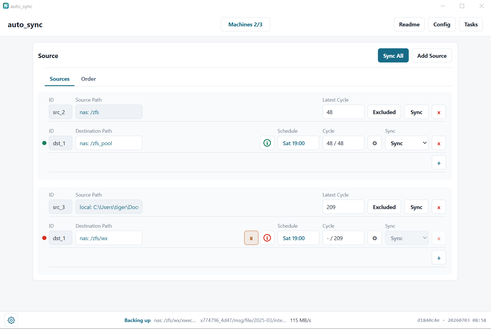

# auto_sync

`auto_sync` 是一个用 Rust 实现的目录同步与备份工具。它以「对账后同步」（reconcile-then-transfer）为核心语义：先并行扫描源树和目标树、比对两份清单，只传输真正有差异的文件与软链，可选镜像删除目标端多余文件，并对本轮写入的内容做端到端校验。对 ZFS 源，系统以 ZFS snapshot + `zfs diff` 作为强一致基础，把百万级文件的对账压缩到秒级。

一个可执行文件 `auto_sync` 同时承载调度器、文件监听、Web 服务，并在有显示环境时打开桌面窗口；`auto_syncctl` 是配套 CLI。支持 Linux（含无头 NAS / OpenWrt）与 Windows，支持局域网多机自动发现与跨机原生 TCP 传输。



---

## 目录

- [功能简介](#功能简介)
- [核心概念](#核心概念)
- [快速开始](#快速开始)
- [性能优化点](#性能优化点)
- [系统设计](#系统设计)
  - [总体架构](#总体架构)
  - [模块划分](#模块划分)
  - [同步引擎](#同步引擎)
  - [任务类型与并发](#任务类型与并发)
  - [ZFS snapshot 后端](#zfs-snapshot-后端)
  - [文件监听（fanotify / USN）](#文件监听fanotify--usn)
  - [调度与 cycle](#调度与-cycle)
  - [一致性与校验](#一致性与校验)
  - [局域网多机与配置委托](#局域网多机与配置委托)
  - [磁盘 standby（冷备盘定时唤醒）](#磁盘-standby冷备盘定时唤醒)
  - [Collector（从 SSH 主机采集文件到 git 仓库）](#collector从-ssh-主机采集文件到-git-仓库)
  - [暂停继续、取消与任务历史](#暂停继续取消与任务历史)
  - [状态与 UI](#状态与-ui)
- [配置文件](#配置文件)
- [HTTP API](#http-api)
- [部署](#部署)
- [安全](#安全)

---

## 功能简介

- **多组源 → 多个目标**：每个源目录（或单个文件）可配置多个目标，每个目标有独立的调度、状态和进度。
- **镜像语义**：`mirror` 模式下源删除的文件会在目标端删除（先进回收站，通过校验后再按保留策略清理）。
- **三种触发策略**：每个目标独立设置 `realtime`（近实时）、`daily`（每天定时）、`weekly`（每周定时）。
- **三种同步动作**：
  - **Full（对账并同步）**：完整扫描两棵树，修复所有差异；
  - **Incremental（增量）**：只重放监听到的事件路径；
  - **Compare（对账不同步）**：只读比对，产出差异报告，不改动任何数据。
- **ZFS 强一致**：源在 ZFS 上时用 snapshot 提供稳定读视图，用 `zfs diff` 增量计划，避免百万文件全树遍历。
- **局域网多机**：UDP 自动发现 + 手动添加机器；跨机同步走 auto_sync 自己的 HTTP + 长连接 TCP 池，无需 rsync/SSH 隧道。
- **桌面 + Web 双端 UI**：同一份 `src/ui` 前端，桌面用 Flutter/WebView2 壳承载，无头机器用浏览器访问 Web UI，共享同一后台状态。
- **断点与并发友好**：大文件按 rsync 式 block delta 只传差异块；小文件成批打包传输；暂停/继续、跨机取消、任务历史一应俱全。
- **跨平台**：Linux 用 fanotify 监听，Windows 用 NTFS USN Journal（并在需要时自动提权），无头 Linux 走 systemd，OpenWrt 走 procd。
- **Collector（文件采集）**：从任意 SSH 主机（`ssh`/`scp`）把配置好的文件/目录拉到一个本地 git 仓库，自动切割超大文件、`commit` 并 `push`。见「系统设计 → Collector」。

---

## 核心概念

| 概念 | 含义 |
| --- | --- |
| **Source（源）** | 一个源目录或单个文件；界面中一个 source group。 |
| **Destination（目标）** | 源要同步到的目的地目录（或已存在的文件）；每个源可有多个。 |
| **Schedule（调度）** | 用户可见的**触发规则**：`realtime` / `daily` / `weekly`。 |
| **Cycle（周期）** | 后端生成的**源版本点**。对 ZFS 源，一个 cycle 对应一个 ZFS snapshot。cycle 创建时间不是备份完成时间；某目标完成后只是把自己的 `verified_cycle` 推进到该 cycle。界面 `Cycle` 列显示 `verified_cycle / target_cycle`。 |
| **Add Directory** | **源侧独有**的开关。勾选时在目标下建一层以源目录名命名的子目录（`dst/<源名>/…`，相当于 rsync 源路径不带尾斜杠）；不勾时源目录内容直接铺到目标根（相当于带尾斜杠）。目标侧没有这个配置。 |

状态颜色：

- **绿**：目标在线，且 `verified_cycle ≥ target_cycle`。
- **黄**：目标在线，但检测到源文件正在变化（`source_changing`）或正在等待同源 Compare 结束（`waiting_for_compare`）或已被手动暂停（`paused`）；点击可看详情。
- **红**：离线、落后、同步失败或校验失败。

---

## 快速开始

### 构建

运行时二进制 `auto_sync` 在一个进程内运行调度器、文件监听和 Web 服务。桌面窗口由独立的 Flutter `auto_sync_gui` 进程打开同一份 Web UI。

```bash
cargo build --release --bin auto_sync --bin auto_syncctl
install -m 0755 target/release/auto_sync   bin/auto_sync
install -m 0755 target/release/auto_syncctl bin/auto_syncctl

cd flutter/auto_sync_gui
flutter build windows --release
```

### 运行

```bash
bin/auto_sync   --config conf/auto_sync.toml            # 调度器 + Web（有显示时含桌面窗口）
bin/auto_sync   --config conf/auto_sync.toml --no-gui   # 强制无头 Web
bin/auto_sync   --config conf/auto_sync.toml --hidden   # 启动时窗口隐藏到托盘（自启动用）
bin/auto_syncctl --config conf/auto_sync.toml status
bin/auto_syncctl --config conf/auto_sync.toml sync-now --close-current
```

Web API 默认监听配置里的 `port`（通常 `18765`）；局域网机器通过 UDP `18766` 互相发现。

### 部署

所有部署都走项目脚本，不要用临时命令：

```bash
# Windows（在 Windows 本机运行）：构建到仓库 bin\，用当前用户登录任务启动单个 auto_sync 进程
pwsh -ExecutionPolicy Bypass -File scripts/deploy_windows.ps1

# Linux / NAS（在目标机本机运行）：构建到 /opt/auto_sync，安装 systemd unit 并启动
scripts/deploy_local.sh --install-dir /opt/auto_sync

# OpenWrt：交叉编译 aarch64，安装 procd init 脚本
scripts/deploy_openwrt.sh --host 192.168.2.1 --port 10022 --user root
```

部署脚本会**保留已有的 `conf/auto_sync.toml`**，只有目标配置不存在时才用模板初始化。NAS 在本机编译（不做 Windows→Linux 交叉编译），保留 Cargo 构建缓存；Windows 运行时以管理员权限自启（以便读取 USN Journal），通过单实例锁接管旧进程。

---

## 性能优化点

`auto_sync` 面向的是「NAS 上 ZFS 数据集，约 60 万～90 万条目、TB 级容量」这种规模，性能优化贯穿对账、传输、监听三条主线：

### 对账（扫描与比对）

- **ZFS `zfs diff` 快路径**：源与目标都在本机 ZFS、且两侧已验证基准快照都在时，Full 和 Compare 都只对「两侧自基准以来变化路径的并集」做同步/比对，并集之外的路径视为已一致——把百万文件对账压缩到与差异量成正比的秒级。任一前提不满足自动回退全树扫描。
- **双树并行扫描**：Full / Compare 回退到全树时，源树和目标树（通常在不同机器上）并行遍历，把对账阶段耗时约减半。
- **每条目单次 lstat**：树遍历对每个条目只做一次 `lstat`，结果在扫描、比对、校验各阶段复用。
- **`zfs diff` 并集裁剪**：`M`（修改）目录只取目录条目本身（变化的子项各有自己的 diff 行），`+`/`-`/`R` 保持整树递归，且被递归祖先覆盖的子路径不再重复走树。
- **只校验本轮写入**：Full 完成后只对本轮实际写入/修改的路径逐个校验（跨机路径在落盘前已做过 blake3 端到端校验），未改动的条目在对账阶段已确认一致，不再整树重扫——避免每轮开销随树规模翻倍。
- **FxHash + 精确判等**：清单比对用 FxHash；判等分两档——全树 quick-check 用 `modify_window_secs`（默认 1s）容差吸收跨平台时间戳粒度，携带变化证据的路径（事件、`zfs diff`）用精确 mtime 比较（仅容忍 Windows FILETIME 的 100ns 截断），避免同尺寸亚秒改写被容差吞掉。

### 传输

- **小文件成批打包**：≤256KiB 的非 delta 小文件按批打进单个 `/api/transfer/put-files-batch` 请求（≤200 个 / ≤8MiB，帧格式 `<json头>\n<原始字节>`）。接收端全部写入临时文件后**成批 fsync**（ZFS 上连续 fsync 合并为约一次 ZIL 刷盘）再统一 rename 发布、父目录去重 fsync——消灭小文件「每文件一次往返 + 一次同步刷盘」的吞吐上限。
- **大文件流式传输**：>16MiB 大文件的余量（断点 offset 起）以单个定长请求体流式发送，接收端边收边写，不再每 16MiB 一个请求体驻留内存；完整性由 finish-file 的全文件 blake3 把关。
- **rsync 式 block delta**：已存在的大文件只传变化块，不整文件重传。
- **长连接 TCP 池**：跨机传输复用 keep-alive 连接池（默认 100 连接），避免每文件握手。
- **介质感知并行**：本地拷贝走统一 worker 池——目标检测为 HDD 时单 worker 顺序写（避免机械盘随机寻道抖动），flash/未知则并行；跨机传输默认 32 路并行（可配 `max_parallel_transfers`）。
- **流式清单交换**：跨机整树快照走 `/api/transfer/snapshot-stream` NDJSON 端点，服务端边走树边发、请求端逐行解析，双端都不缓冲整份 JSON。
- **整棵子树快拷贝**：大范围新增时按子树整体并行拷贝，而非逐文件调度。

### 监听与启动

- **fanotify 懒加载 handle 表**：可用 `open_by_handle_at` 时不再预建全树 handle 表（90 万条目 HDD 上预建约 3 分钟），事件到达时按需解析路径并缓存，缓存上限 131072 条、溢出即清。
- **filesystem mark 免递归**：filesystem/mount mark 模式下新建目录天然被覆盖，无需递归补注册 mark。
- **不做启动全树扫描**：重启不再每次做全树 mtime 扫描（90 万条 HDD 树一次要 10 分钟以上随机读）；Windows 用持久 USN journal 覆盖停机窗口，Linux 用「重启提醒」让用户按需 Compare/Full。
- **进度节流**：进度视图更新有节流，避免高频刷新拖慢传输主循环。

---

## 系统设计

### 总体架构

系统按职责分为五层，全部运行在单个 `auto_sync` 进程内：

1. **配置层**：读写 `conf/auto_sync.toml`，管理 source/destination、调度、机器列表、日志与传输参数；GUI 改配置时原子替换文件。
2. **状态层**：SQLite（WAL 模式）持久化事件、周期、offset、任务和校验结果；进程重启后据此恢复。
3. **事件层**：Linux 用 fanotify、Windows 用 USN Journal 收集源目录变化，作为触发提示落盘。
4. **同步层**：cycle 到点时为每个目标生成同步计划，执行拷贝/删除/校验并推进 offset；跨机时通过 peer HTTP + TCP 传输执行。
5. **展示与控制层**：Flutter 桌面窗口与 Web UI 展示配置、状态、进度；后台按 `status_log_interval_secs` 输出状态日志；`auto_syncctl` 提供 CLI 控制。

进程形态：

- **后端/Web 模式**：`auto_sync` 始终运行 scheduler、watcher 和 HTTP/Web UI，浏览器可直接访问同一前端。
- **桌面模式**：`auto_sync_gui` 是 Flutter Windows 应用，使用 WebView2 打开 `auto_sync` 提供的 Web UI；URL 带加载时间戳以规避 WebView2 陈旧缓存。
- **后台模式**：Linux 由 systemd 拉起，Windows 由当前用户 Startup launcher 拉起后端和 Flutter GUI。

### 模块划分

代码位于 `src/core/`，实际模块（按职责）：

| 模块 | 职责 |
| --- | --- |
| `backend.rs` | 业务门面：配置读写、状态聚合、手动同步/取消入口、配置委托与反向删除。 |
| `config.rs` | 配置结构、加载、校验、规范化（含源/目标嵌套检查、路径类型规则）。 |
| `state.rs` | SQLite 状态库：cycle、offset、event_log、destination_issue、task_log 的读写与恢复。 |
| `storage.rs` | SQLite 连接、PRAGMA、schema 初始化与迁移。 |
| `scheduler.rs` | daily/weekly 周期计算，判断每个目标的 schedule 是否到期。 |
| `standby.rs` | 冷备盘 standby：唤醒窗口计算、按挂载根匹配任务、挂载安全校验、`hdparm -Y` 停转。 |
| `sync/mod.rs` | 同步引擎核心：Full/Incremental 计划与执行、双树扫描、拷贝/删除/校验、跨机传输、暂停语义。 |
| `sync/delta.rs` | rsync 式 block delta 算法。 |
| `watcher/fanotify.rs` | Linux fanotify 监听（FID/name 模式、懒加载 handle 解析、overflow 处理）。 |
| `watcher/windows_usn.rs` | Windows NTFS USN Journal 监听，及 `ReadDirectoryChangesW` 回退。 |
| `machines.rs` | 局域网机器发现、HTTP peer 调用、长连接 TCP 传输池、流式传输原语。 |
| `web_api.rs` | HTTP API 路由（状态、同步、取消、传输端点、配置委托）。 |
| `peer_notify.rs` | 把本机状态变化推送给对端机器，UI 约 2s 内刷新。 |
| `progress.rs` | 扫描/传输实时进度视图，按 source/destination 归属。 |
| `cancel.rs` | 协作式取消令牌，贯穿遍历、传输 worker、分块发送各检查点。 |
| `signal.rs` | watcher-armed 握手（等所有 mark 就位再放行调度，堵住启动丢事件窗口）。 |
| `status.rs` / `logging.rs` | 状态文本聚合、tracing 日志初始化（按天滚动）。 |

入口在 `src/bin/`：`auto_sync.rs`（主进程：单实例锁、可选提权、调度线程、Web/桌面）与 `auto_syncctl.rs`（CLI）。

### 同步引擎

三种动作共享「完整对账 + 只修复差异」的语义，区别在计划来源：

**Full（对账并同步）** — 用户在单个目标上手动触发（`Sync… → Full`），此外**目标首次同步**（无基准可增量）和**事件丢失后的全量重扫**也走同一条全量路径（引擎自动进入，Tasks 里同样标为 Full）。`Sync All`、源级 `Sync`、目标级 `Incremental`、realtime 自动触发按增量处理。Full 有两条实现，由 `sync.zfs_diff` 配置（全局默认 true，每个目标可覆盖关闭）自动选择：

- **`zfs diff` 版**：源与目标都在本机 ZFS 且两侧基准快照都在时，`zfs diff` 各取两侧变化路径，对并集执行按路径同步（复制差异、mirror 删除多余、类型替换），并集之外不触碰。
- **对比版**：前提不满足时回退——双树并行扫描 + 清单对账，执行顺序为：读源信息 → 并行生成源/目标完整清单 → 类型不同则先删除替换 → 批量建目录 → 只复制缺失或不匹配的文件/软链（大文件走 block delta）→ mirror 删除目标多余项 → 清理临时目录 → 只校验本轮写入。

复制中源文件发生变化（size/hash 校验不过）不会让目标变红：该路径记 `source_changing` 黄色 issue，其余文件照常传，下一轮收敛（详见 [活跃源的收敛](#活跃源的收敛与脏文件)）。单文件硬失败最多容忍 20 个，连接级失败才立即终止本轮。

**Incremental（增量）** — 重放 event_log 中该目标自上次 verified cycle 以来的事件路径，只对这些路径做增量同步。积压中出现 `rescan_required`（overflow / USN gap）或目标从未完成首次全量时，自动退回完整 reconcile。

**Compare（对账不同步）** — 只读比对，产出差异报告，不改动数据。同样有 `zfs diff` 快路径与全树回退。报告差异存在时目标行显示修复按钮（⇆），点击后只同步这些差异路径；若差异过多导致报告被截断，修复会自动升级为全量对账（见[任务类型与并发](#任务类型与并发)的 Repair → Full）。

**跨机传输**：源/目标清单、批量 mkdir、批量 remove、文件推送都通过 peer HTTP transfer API 执行。本机 ZFS 源先创建 snapshot 只读视图供读取；目标有已验证基准快照时优先 `zfs diff` 增量。传输细节见[性能优化点](#性能优化点)。

**回收站与临时目录**：mirror 删除统一进 `.auto_sync_trash/<cycle>/`，通过校验后按 `sync.trash_keep_days`（默认 30 天，0=永久）清理；临时文件写 `.auto_sync_tmp/<cycle>/`，完成后 fsync + 原子 rename，非当前 cycle 残留 7 天后清扫。`.auto_sync_*` 内部目录永不进入 diff 并集、清单或 mirror 删除集，且**源、目标两侧遍历都剪掉**（源本身也可能是别处的目标而积累了 `.auto_sync_trash`）。

### 磁盘 standby（冷备盘定时唤醒）

顶层配置 `standby_pools`：把冷备 HDD 池设成"只在计划窗口内唤醒"，窗口外的一切 sync/compare/full 都被推迟（任务积压），盘保持停转。为空时功能完全休眠，所有盘始终可用。

每个池：`name`、`mount_roots`（该池的挂载根，任务的源或目标落在其下即受门控）、`devices`（`/dev/disk/by-id/...`，用于 `hdparm -Y` 停转）、`active_spindown`（true 才主动停转，否则只推迟任务、停转交给系统 `hdparm -S`）、`wake`（`every_weeks` 周期 + `weekday` + `time` + `anchor_date` 计数锚点 + `max_window_minutes` 窗口上限）。

- **门控（目标驱动 + 源盘按需唤醒）**：`sync_cycle_for_source` 处理每个目标前调用 `standby::gate_for_sync(源根, 目标根)`。**门控只看目标所在池的唤醒窗口**（备份落在目标盘，其唤醒计划就是这条备份的节奏）：目标池不在窗口 → 目标置 `yellow`（原因 `disk <pool> in standby until <下次唤醒>`），不执行不失败，等目标池下个窗口批量补齐。**若源在另一块 standby 盘上（链式备份），源盘不受自己窗口门控，而是按需唤醒**——目标池开窗即放行，读源盘的 I/O 自动把它转起来，`busy()` 在同步期间保持它唤醒。若目标盘非 standby、源盘是 standby，则改由源盘窗口门控（冷源读取仍批量化）。
- **链式依赖免配置对齐**：`/zfs→/zfs_pool`（src_2）由 `/zfs_pool` 每 4 周开窗触发，`/zfs` 被按需拉醒来读，**无需人为对齐两池窗口**——`/zfs` 自己的每周计划与 src_2 无关。其余周 `/zfs` 开窗只跑写入 `/zfs` 的 src_4/src_5，`/zfs_pool` 不被触及、保持停转。
- **挂载安全（源和目标都校验）**：任务放行前校验它触及的**每个**池（源池 + 目标池）的 `mount_roots` 确实是挂载点（`st_dev` 与父目录不同）。若某池未导入、`/zfs` 只是根文件系统上的空壳目录 → 置 `red: disk <pool> not mounted`，**拒绝同步**。源盘同样校验：读到空的源树会和空目标一样把整份备份镜像删光。
- **停转时机(基于 cycle 完结,非空闲计时)**:调度循环每 tick 驱动 `standby::tick(pools, busy)`。**完结判定的核心是 `busy(pool)`**:有 sync 正在跑且触及该池,**或**有"待办且可运行"的工作触及它(该工作用 `gate_for_sync` 放行,且目标 `target_cycle_id > last_verified` —— 即**该池上还有已锁定但未校验完的 cycle**)。只要还有 cycle 没跑完,`busy` 恒为真、盘保持唤醒。`busy` 转假的**唯一条件**是所有触及该池的目标都 `verified == target`(积压 cycle 全部完结)。
  - **target 是快照,不追新**:`advance_due_destination_targets`(state.rs:543-546)在 `verified < target` 期间**跳过该目标不再前移** —— 窗口内 target 只在调度边界锁定一次(到当时最新 closed cycle),reconcile 一趟批量补齐 `verified→target` 的事件并集。drain 完后新开的 cycle 其调度边界落在**下个窗口**,故本窗口不追。这正是"把时间点前触发的 cycle 全部跑完、之后触发的等下轮"。
  - **90s 是完结后的防抖 settle,不是空闲计时**:`busy` 转假(cycle 已完结)后再等 `PARK_IDLE_GRACE_SECS`=90s 才 `hdparm -y` 停转,用于抹平"standby 窗口 09:00 先于同步调度边界 10:00 开"这类空档、以及多目标/多源收尾的瞬时抖动,避免刚停又被唤醒。
  - 停转条件 = `busy` 假 且(**窗口外** 或 **窗口内已 settle 满 90s**)。链式依赖天然正确:`/zfs` 自己的 src_4/src_5 完结后,只要 src_2 仍"可运行且 target>verified"(即 `/zfs_pool` 开着窗——src_2 的门控盘),`busy(/zfs)` 仍为真、`/zfs` 被按需保持唤醒直到 src_2 也完结;`/zfs_pool` 关窗时 src_2 被门控挡住、不计入 `busy(/zfs)`,故 `/zfs` 完结即停转。开机时若在窗口外,首 tick 直接停转。

  三个判定各司其职(**别把 90s 当成完结信号**):

  | 判定 | 依据 | 作用 |
  | --- | --- | --- |
  | cycle 是否完结 | `busy = 有 sync 在跑 或 target > verified` | 只要没完结,盘恒唤醒 |
  | target 是否追新 | 不追 —— `verified<target` 期间跳过前移,边界内只锁一次 | 时间点前触发的 cycle 全 drain,之后的等下轮 |
  | 90s | 仅在 `verified==target`(已完结)之后起算 | 完结后的防抖 settle,非空闲计时 |

  即:**到点 → 锁定当时全部积压为 target → 一趟批量 drain 到 `verified==target`(cycle 完结)→ 才起 90s settle → 停转**。settle 期间若又有"本窗口该做"的 cycle 被锁定(`target>verified` 复真),`busy` 立刻转真、重新保持唤醒,不会误停。
- **积压如何 drain（批量补齐,非逐 cycle）**：窗口外事件持续累积成一个个 closed cycle,但目标不 sync（门控推迟）。窗口打开后 `advance_due_destination_targets` 把该目标的 `target_cycle_id` 一次推进到**最新 closed cycle**,然后**一次 reconcile**：`events_between_cycles(last_verified, target)` 取从上次已校验到目标之间**所有 cycle 的事件并集**,合并去重后一次性同步,`last_verified` 直接从旧值跳到 target(如 103→133),**不是逐个 cycle 分别同步**。所以"一周/四周积压"是一趟批量补齐,drain 完 `target==verified`,`busy` 转假,盘按上面的规则停转。

**端到端时序(以 `/zfs` 每周六、`/zfs_pool` 每 4 周六为例)：**

| 时机 | `/zfs_pool` 窗口 | src_4/src_5(→`/zfs`) | src_2(`/zfs`→`/zfs_pool`) | `/zfs` 盘 | `/zfs_pool` 盘 |
| --- | --- | --- | --- | --- | --- |
| 平日 | 关 | 门控推迟,积压 | 门控推迟,积压 | standby | standby |
| 非第 4 周六 | 关 | `/zfs` 开窗 → 批量 drain | 目标 `/zfs_pool` 关 → 仍推迟 | 唤醒→drain→空闲 90s→停转 | 保持 standby |
| 第 4 周六 | 开 | 先批量 drain 到 `/zfs` | `/zfs_pool` 开 → 放行,**按需拉醒 `/zfs`** 读取 → 批量 drain | 被 src_2 按需保持唤醒,直到 src_2 也 drain 完再停转 | 唤醒→drain→空闲 90s→停转 |

关键：src_2 只由**目标盘 `/zfs_pool`** 的窗口触发(每 4 周),`/zfs` 作为源被**按需拉醒**,两池窗口无需人为对齐;各盘在自己那趟积压 drain 完后才停转,`/zfs` 在第 4 周六会多撑到 src_2 结束。

### Collector（从 SSH 主机采集文件到 git 仓库）

与同步引擎完全独立的一个功能：把散落在各台机器上的配置/数据，按需拉到 Windows 本机的一个 git 仓库里做版本化冷备。通过顶栏 **Collector** 按钮打开弹窗配置和触发，**只在点击时运行，不参与任何调度**。实现见 `src/core/collector.rs`，全部通过系统自带的 `ssh`/`scp`/`git` 命令完成（无第三方 SSH 库，Windows 内置 OpenSSH 即可）。

**配置**：独立配置文件 `collector.toml`（与 `auto_sync.toml` 同目录，**不写进主配置**），UI 弹窗读写（`GET`/`POST /api/collector/config`）。弹窗底部 **Config** 按钮显示该文件的路径和内容。字段：

- `git_dir`：本地 git 仓库目录（不是 git 仓库时自动 `git init`）。
- `split_threshold_mb`：文件 ≥ 该大小（MiB）就切割成 `<名字>.autosplit.NNN`，原文件加入 `.gitignore`、只提交分片。默认 95，留在 GitHub 100 MiB 硬上限之下；0 关闭切割。
- `auto_commit_push`：拉取成功后自动 `git add -A && git commit && git push`。
- `hosts[]`：每个目标主机一条，用**结构化字段**描述连接（没有 ssh 配置文件，引擎直接拼 `ssh`/`scp` 的 `-i`/`-p` 参数）：
  - `name`（Host 别名/标签）、`hostname`（HostName）、`user`（User）、`port`（Port，默认 22）、`identity_file`（IdentityFile，支持 `~` 展开）。
  - `root`：本地根目录；`paths[]`：要拉取的远端绝对路径（文件或目录），在 host 行的 **Files (N)** 按钮里编辑。
  - `exclude[]`：采集时忽略的远端绝对路径（等于或位于其下的都跳过，**从不传输**，不是拉下来再删）。在 Files 弹窗底部的 **Ignore** 文本框里每行一个。含 exclude 的目录会改为逐个子项选择性 `scp`（不含 exclude 的子树整体拉、含的递归下去），例如 aws 忽略 `/usr/local/blog/logs`、`/usr/local/blog/.backup-worktree`、`/usr/local/tbox/log`、`/usr/local/tbox/logs`。
  - `enabled`：关掉则跳过该 host。

> 注：新版 OpenSSH `scp` 走 SFTP 协议，远端缺 `sftp-server`（如全新 OpenWrt）会拉取失败并记日志——自行在远端装好即可（例如 `apk add openssh-sftp-server` / `opkg install openssh-sftp-server`）。

**路径重建规则**：远端路径的目录结构原样保留在 host `root` 之下。root=`D:\share\linux\aws`、远端 `/usr/local/shadowsocks` ⇒ 落到 `D:\share\linux\aws\usr\local\shadowsocks`（`scp -r -p` 把叶子拷进重建出来的父目录；`..` 和裸 `/` 会被拒绝，防止逃出 root）。

**UI（全部在 Collector 弹窗内）**：每个 host 一行，列为 Host / HostName / User / Port / IdentityFile / Root（本地文件夹选择器）；**Files (N)** 按钮弹出该 host 的文件/文件夹列表，可手输或点 **Browse remote…** 通过 `ssh ls` 逐级浏览选取（`POST /api/collector/browse`，参数为该 host 的连接字段）。**Save & Run** 先存配置再后台起线程执行，弹窗底部实时刷新运行日志（`GET /api/collector/status` 每秒轮询）；同一时刻只允许一个采集在跑。

**运行流程**：逐 host 逐 path：`scp -r -p`（带 `-i`/`-P`）拉取 → 切割超大文件、更新 `.gitignore` → 若开启则 `commit`/`push`。单个 path 失败只记日志不中断，最后汇总失败数;切割是幂等的（重跑先删旧分片再切）。要还原原文件，把分片按序拼接即可（`cat *.autosplit.* > 原名`）。

**Deploy（回灌 + 起服务，反向操作）**：每个 host 行的 📝 图标打开该 host 的 **deploy 脚本**（每 host 独立、可编辑、自动存进 `collector.toml` 的 `deploy_script`），▶ 图标 **在本机（Windows）运行**该脚本（需二次确认，因为会写目标机）。脚本**运行在 Windows 上**（PowerShell），自己用捆绑的 `ssh`/`scp` 推文件、改权限、起服务；引擎只注入一套环境变量供脚本使用：`AS_SSH`/`AS_SCP`（优先用随程序附带的 OpenSSH，否则走 PATH）、`AS_HOSTNAME`/`AS_USER`/`AS_DEST`/`AS_PORT`/`AS_KEY`（本 host 连接参数）、`AS_ROOT`（本地收集根，如 `D:\share\openwrt`）、`AS_HOST_<名字大写>`（每个 collector host 的 hostname，脚本可据此替换配置里的服务器地址，如 `AS_HOST_AWS`）。后台线程执行、弹窗实时刷日志（`POST /api/collector/deploy` + `GET /api/collector/deploy-status`），同一时刻只允许一个 deploy。⚠️ 会覆盖目标机上的系统文件并重启服务，务必确认脚本正确。

**权限缓存**：Windows 存不下 Unix 权限位，所以采集时引擎会用 `find … -exec ls -ldn`（该 busybox 无 `stat`）读出每个文件/目录的八进制 mode，写进**每个 host 一个**的缓存 `<root>/.auto_sync_perms`（`mode 路径` 每行一条）。deploy 时把该缓存路径通过 `AS_PERMS_FILE` 交给脚本，脚本在重启服务前逐条 `chmod` 还原（可执行位、`0600` 私钥等都能恢复）。

服务器地址替换在 **Rust 侧**完成（不用脚本做字符串替换，避免出错）：deploy 前若该 host 收集了 `usr/local/shadowsocks/conf/shadowsocks-client.json` 且存在名为 `aws` 的 host，引擎会用 serde_json 解析该配置，按**地址族匹配**改写 `servers[]` 里的 `server`——aws 的 hostname 是 IPv4 就改 IPv4 那段、是 IPv6 就改 IPv6 段——把结果写到临时文件，通过 `AS_SS_CLIENT_CONF` 交给脚本 `scp` 上去。

> 附带的 OpenWrt deploy 脚本示例（`collector.toml` 里 openwrt 的 `deploy_script`）：先做一次性 **provision**（把 apk feeds `/etc/apk/repositories.d/distfeeds.list` 里的官方 `downloads.openwrt.org` 换成 `http://mirrors.tuna.tsinghua.edu.cn/openwrt`；`apk update`；把 busybox `dnsmasq` 换成 `dnsmasq-full`——换之前先把 `/etc/resolv.conf` 指到公共 DNS，避免删掉 dnsmasq 后路由器自己断网；busybox `vi` 是内建 applet 删不掉，改装 `vim-full`；再 `apk add` 一批存储/nftables/tproxy/kmod-tcp-bbr 等包。重活用标记文件 `/etc/auto_sync.provisioned` 只跑一次，`rm` 掉即可重跑，换源那步每次都幂等执行）→ 停 shadowsocks 再把 `D:\share\openwrt` 下收集到的树 `scp` 回路由器对应目录（停服务是为了让 sslocal/xray-plugin 二进制不被占用）→ 用引擎备好的 `AS_SS_CLIENT_CONF`（已按族替换好 server 地址）覆盖远端 `shadowsocks-client.json` → 按 `AS_PERMS_FILE` 还原权限 → `sysctl -p`、重启 dnsmasq/odhcpd、`network reload` 让配置生效 → `enable`+`restart` shadowsocks（`sslocal`），并 `disable`+`stop` shadowsocks-rust（`sslocal-master`）避免 procd NAME 冲突。

### 任务类型与并发

每次操作都在**执行机**的 `task_log` 表记一行，Tasks 面板按机器分组展示。当前的任务类型：

| 类型（UI） | task_log kind | 触发来源 | 说明 |
| --- | --- | --- | --- |
| **Full** | `full` | 手动 `Sync… → Full`；**目标首次同步**；事件丢失后的全量重扫 | 完整读源+目标两棵树、对账、只修差异。首次同步没有基准可增量，因此必然是 Full——即使由调度器自动发起。 |
| **Incremental** | `incremental` | 调度器到点/事件、`Sync All`、源级 `Sync`、目标级 `Incremental`、realtime | 只重放 `event_log` 中该目标自上次 verified 以来的事件路径。缺基准时自动退回完整 reconcile。 |
| **Compare** | `compare` | 手动 `Sync… → Compare` | 只读对账，产出差异报告，不改动数据。 |
| **Repair** | `repair_scan` | 点目标行的修复按钮（⇆） | 只同步上一次 Compare 报告里的差异路径（定点修复，不重扫整树）。 |
| **Repair → Full** | `repair_full` | 点修复按钮（⇆），但报告被截断 | Repair 因差异过多被**升级为全量对账**（见下）。task_log 记 `repair_full`，Tasks 与 Info 都显示 `Repair → Full`——既保留触发动作（Repair），也表明实际执行（Full）。 |

（历史类型 `startup_scan`、`changed_since` 已移除，不再产生。）

**Repair 何时升级为 Full**：Compare 报告每个差异类别（新增/更新/删除/类型不符/权限）最多存 `SCAN_DIFF_PER_KIND_CAP = 200` 条样本。若**任一类别的真实差异数 > 200**，报告存不下全部、被标记 `truncated`。此时点修复,只修样本会漏掉其余，所以 `queue_scan_repair` **自动升级为完整 reconcile**（`mark_cycle_manual_full_rescan`）——即把这次 Repair 当 Full 跑，修复包括目标侧漂移在内的所有差异。全部类别都 ≤ 200 时才走定点 Repair。

**并发保证：任何时刻，同一个 `源 → 目标` 对最多只有一个任务在运行**——自动触发还是手动触发都一样。由三重机制保证：

1. **SYNC_GATE（进程级互斥锁）** 串行化机器上**所有** sync pass。调度器的自动 pass、以及 Web/CLI/桌面手动触发的 sync，都必须先拿这把锁，拿不到就阻塞等待。所以两个 sync 永不并发，同一目标自然也不会有两个 sync。
2. **SCAN_GATE** 串行化所有 Compare；Compare 之间也不并发。
3. **跨闸门按目标互斥**：Compare 启动时若发现该目标正有 sync 在跑，直接拒绝（"a sync for this destination is running"）；sync 遇到该目标正有 Compare 在跑，则把该目标延后（黄色 `waiting_for_compare`），Compare 结束后下一个 tick 补上。因此同一目标上 sync 与 compare 绝不重叠。

调度器本身是单线程，自动 pass 之间天然不重叠。

**具体到「新增源→目标」的场景**：新增后调度器发起首次 **Full**（持 SYNC_GATE）。若此时源目录有文件更新，只会**写入 `event_log`**，不会并发触发一个增量任务——增量同样要 SYNC_GATE，且单线程调度器正阻塞在 Full 里。Full 跑完后，下一轮 pass 才把累积的事件做成增量。全程该「源→目标」只有一个任务。

### ZFS snapshot 后端

ZFS 后端是百万文件规模下的首选一致性方案：创建 snapshot 近似瞬时，不随文件数线性复制。

- **快照命名**：`<dataset>@<prefix>_<source_id>_<cycle_id>`。auto_sync 只管理自己 `prefix` 命名的快照，绝不碰用户或其他工具创建的快照。
- **dataset 识别**：对 source realpath 在 `zfs list` 挂载点上做最长前缀匹配；源是 dataset 子目录时，仍对整个 dataset 建快照，解析 `zfs diff` 时只保留子目录下的路径。
- **嵌套挂载守卫**：解析 dataset 时读 `/proc/self/mounts`，若树内有外来挂载点（嵌套 dataset、bind mount，`.zfs` 自动挂载除外）则拒绝对该树用 snapshot/diff——否则快照读视图会把嵌套子树当成「已删除」。此时 auto 后端降级 manifest 活树读并告警，显式 zfs 后端报错。
- **基准快照与刷新守卫**：目标基准快照（`<prefix>_dstbase_…`）只允许由**全树级验证**的成功路径刷新；只看源侧的 `zfs diff` 增量只推进源基准、**保留**旧目标基准（Retain），避免把期间的目标漂移「洗进」新基准。刷新前用 `zfs diff 旧基线→新基线` 交叉核对本轮触碰集，发现外部写入则降级 Retain。
- **快照清理**：按 refcount 执行（cursor 引用 + 运行中 task 引用 + `keep_extra_cycles` 窗口 + 最新快照），只有 refcount 为 0 的 auto_sync 快照才进入删除；后台限速执行，失败只记状态不影响同步。

非 ZFS 源回退 manifest 模式：从 live source 读取，用复制前后 fingerprint 校验捕捉「正在写入的文件」，一旦 size/mtime/hash 变化就标 `source_changing` 并跳过，不推进 verified offset。百万文件场景建议把源放到 ZFS 上。

### 文件监听（fanotify / USN）

监听的职责是尽快发现运行期变化并触发近实时同步，**不承担最终一致性的唯一责任**——最终一致由 Full/Compare 兜底。

**Linux（fanotify）**：优先 FID/name 模式（`FAN_REPORT_FID | DIR_FID | NAME | TARGET_FID`），注册 create/modify/close_write/delete/move/delete_self/move_self 等事件。`file handle → path` 优先懒加载解析并缓存；解析路径必须落在 source root 内。每个 source 单独一个 fanotify group，一个源的 `FAN_Q_OVERFLOW` 只把该源标记 `needs_reconcile`，不污染其他源。FID 模式或 filesystem mark 不可用时回退传统 fd-path 模式。

**Windows（USN Journal）**：优先读 NTFS USN Journal（持久，覆盖停机窗口，游标断档自动记 `rescan_required`）；权限/环境不支持时回退 `ReadDirectoryChangesW` 递归 watcher。启动默认要求 elevated 进程：非管理员且未尝试过提权时用 `runas` 重新拉起 elevated 进程并退出当前进程（需 UAC 确认），失败则以普通权限继续。

**启动语义（停机窗口）**：不再每次重启做全树 mtime 扫描。调度器启动 watcher 并等其上报 armed（所有 mark 就位，上限 15 分钟）后，是否升起重启提醒**取决于该源所在机器的 watcher 能否覆盖停机期间的变化**（`watcher_covers_downtime()`，Windows 为 true、Linux 为 false）：

- **Windows（NTFS USN Journal，持久）**：USN Journal 是文件系统级的持久日志，进程/系统重启都不会丢。watcher 把上次读到的位置存进 `windows_usn_cursor` 表，重启后从该游标继续回放,停机期间的所有变化都会被补齐（游标断档才记 `rescan_required`）→ **没有遗漏，无需任何提示**。
- **Linux（fanotify，非持久）**：fanotify group 是绑定进程 fd 的内核对象，进程一退出，group 和未读事件就消失，没有任何持久日志。所以停机期间源发生了什么，重启后**无从得知** → 为每个本机监听的源升起**重启提醒**（source 行 Latest Cycle 旁的 ⚠），直到用户对该源成功完成一次「提醒之后发起的」Compare/Full（用时间戳区分，避免把重启前就在跑的动作误当覆盖），或点击 ⚠ 手动忽略。重复重启不刷新已有提醒（gap 起点只增不减）。

> 因此 `src_2`（源 `/zfs` 在 NAS，fanotify 监听）重启后会出现 ⚠ 提醒，而 `src_3`（源在 Windows，USN 监听）不会——正是 NTFS USN 持久、fanotify 非持久这一差异导致的。

### 调度与 cycle

- 每个目标独立判断自己的 schedule 是否到期；同源多个目标在同一窗口需要同一版本点时复用同一 cycle/snapshot。
- **realtime**：fanotify/USN 尽快触发小批量同步。**不做后台周期对账**（用户明确决定）：疑似丢事件（overflow、USN gap、启动 gap）自动触发一次完整 reconcile 修复；其余漂移由用户手动 Scan 检查、Full 修复。`reconcile_interval` 配置保留但当前不驱动周期任务。
- **daily / weekly**：同样监听源目录，事件持续累积，到点时把该目标自上次 verified cycle 以来所有 cycle 的事件积压一次性应用（event-path 增量），而非全树扫描；出现 `rescan_required` 或首次全量则退回完整 reconcile。事件保留到所有 enabled 目标都 verified 越过其 cycle 才修剪。
- **手动同步**：为选定源关闭当前 open cycle、创建新 target cycle，让 enabled 目标追赶。目标离线或校验失败不推进 `verified_cycle`，下一轮继续重试。

> 历史说明：Changed-Since 模式已移除，其语义由 `zfs diff` 增量与 Full 覆盖；只写不读的 `path_snapshot` 表已删除（建库时 DROP，老库一次性回收）。

#### cycle 如何增长

界面「Latest Cycle」按**源安静了几次**在涨，**不是按写了几个文件**在涨。理解这点能避免误解「几十万文件为什么只 +几个 cycle」：

- **cycle 是源的版本点，不是每文件一个**。同一时刻源始终只有一个 `open` cycle 在累积事件；一个 cycle 会把它开着这段时间里的**全部**文件事件（可能几十万条）打包进去。
- **关闭条件（防抖）**：对没到 schedule 的源，只有当「有堆积事件」**且**「源已静默 ≥ 10 秒」（`source_events_quiesced`）时，才关闭当前 open cycle、Latest Cycle +1，并开一个新的 open cycle。这是刻意防抖——否则稳定写入会每个调度 tick（5 秒）就铸一个 cycle。
- **推论**：一次**连续不断**的写入/传输（中间没有 ≥10 秒空档）**只 +1 个 cycle**（在它结束、安静下来那一刻关闭）。若看到 +N，说明这段时间里有 N 个「忙一阵→静默≥10 秒」的独立波次——例如跨越数小时的多波活动，每波各关一个 cycle。cycle 数反映的是「安静间隙的个数」，与文件数量无关。
- **事件数 ≠ 文件数**：一个文件的一次改动会产生多条 fanotify/USN 事件（create、modify、close_write…），所以一个 cycle 里的事件条数通常远大于实际变更的文件数（例如一个 cycle 记录 60 万条事件，对应的可能只是十几万个文件）。想判断「真正改了多少」，应看去重后的路径数或跑一次 Compare，而不是数 cycle、也不是数原始事件。
- **一个文件出现在多个 cycle 里**：增量同步把 `(verified, target]` 区间内所有 cycle 的事件路径**去重成一个集合**（`BTreeSet`）再逐一处理，所以该文件**只复制一次**；即便如此也要先和目标端比对指纹，一致则跳过、不重传。

#### 落后多个 cycle 如何追平

目标可能落后源好几个 cycle（如 weekly 目标平时 verified 停在旧 cycle、Latest 一直涨）。触发同步时**一趟直接追平到最新，而不是一个 cycle 一趟**：

- 调度到点或手动触发时，`advance_due` / `force_target` 关闭当前 open cycle 并把该 cycle（**最新的**）设为目标；中间被跳过的 cycle 不单独设目标。
- **增量**：`events_between_cycles(verified, target)` 取出从上次 verified 到目标之间**所有** cycle 的事件积压，去重后在**一趟** pass 里全部应用，verified 直接跳到目标（最新）。不逐 cycle 步进。
- **Full**：直接对源当前状态做整树对账，同样一趟追平到最新。
- 若积压里出现 `rescan_required`（overflow / USN gap）或目标从未首次全量，增量自动退回完整 reconcile。

### 一致性与校验

保证「不丢失任何文件不一致」的关键机制：

- 事件先落盘再进内存队列；overflow/watcher 中断标记 `needs_reconcile`。
- ZFS 源基于 snapshot/diff 生成最终计划，而非只信事件流。
- 每个目标独立 cycle offset，离线不跳周期，恢复后从最旧未验证 cycle 追赶；offset 只在任务完成且校验通过后推进。
- 临时文件 + fsync + 原子 rename 降低崩溃半文件风险；重启时把遗留 running 任务恢复为 retry，未验证 cycle 重新校验或重做。
- rename 失败只对跨设备（EXDEV，降级 copy+delete 进回收站）和已消失（NotFound）两类安全错误降级，其余向上报错，绝不静默递归硬删。

> realtime 绿点语义是「事件都已应用」，不等于「整棵树已验证」——这是用户接受的取舍。Compare 用于检查漂移，手动 Full 用于修复。

#### 活跃源的收敛与脏文件

非快照源（NTFS/ext4，从 live 文件系统直接读）在同步期间可能一直被写入——典型如正在运行的应用数据目录。这类源里总有文件在「复制前 fingerprint」和「复制后 fingerprint」之间发生变化，被判定为 `source_changing`。auto_sync 的处理策略（保证既不无限重扫、也不丢文件）：

- **检测**：与文件系统无关——对每个文件在复制前后各读一次 fingerprint（size/mtime/hash），不一致即判定该文件在复制途中被改。ZFS 源从不可变 snapshot 读取，前后必然一致，因此几乎不会触发；这条路径实际只作用于 live 源。
- **本轮容忍并推进 verified**：一轮里只有 `source_changing`（无硬失败）时，把该目标的 `verified_cycle` 推进到当前 cycle。这一步是关键——否则 `verified < target` 会让调度器在每次 watcher 唤醒时**重新全量扫描整棵树**，对一个永不静默的源形成无限 churn。推进后，下一轮的 ready 判定在**扫描之前**就跳过该目标，不再重扫。
- **脏文件延到下一轮**：每个被改的路径被登记为 `event_log` 里一条事件行（cycle_id 大于刚推进的 verified）。下一次该目标拿到新 target 时，增量规划器按 `(verified, target]` 的 cycle 区间查事件（`events_between_cycles`），这些脏文件自然被查出，只**增量补传这几个路径**，不重扫整棵树。watcher（USN/fanotify）本身也会独立记录这些写入，是第二重保险；两者都进同一张 `event_log`。
- **不会丢**：事件清理只删除「所有目标都已 verified 越过」的 cycle 的事件（`cycle_id ≤ verified`）；脏文件事件在更大的 cycle 上，一直保留到真正同步掉。
- **界面可感知**：只要某目标存在未清的 `source_changing` issue（脏文件尚未补传），它在界面上就保持**黄色**（即使 verified 已推进、内部状态已转绿），黄点提示「N changing files」，点击弹窗列出具体路径与所属 cycle。等下一轮把这些路径补传成功、issue 清空后自动转绿。因此「本轮出现了文件在写入」这一情况**无需等待下一个 cycle 就能在当前界面看到**。
- **诚实的边界**：若某个文件每个周期都仍在被写（一直不静默），它会每轮被重新检测、重新延后——但每轮只重试**这一个路径**（非整棵树），且它一旦有片刻安静就会被同步掉、从待办中消失。树的其余部分始终干净收敛。

### 局域网多机与配置委托

- **发现**：UDP `18766` 广播发现对端；也可手动添加机器（host、port、SSH user/port、OS、install_dir）。Web UI 路径选择器可切换机器浏览远端目录。
- **委托执行**：源选在远程机器时，控制机保存配置后把该 source group 下发到源所在机器，由源机器的进程真正执行。下发的 group 把源机器自身重写为 `local`，并用 `managed_by` 标记控制机；控制机只保留完整配置供 UI，并通过网络读远端最新状态。
- **双向删除传播**：控制机删除委托条目时，其推送的（可能为空的）集合让执行机同步删除；反方向，执行机删除带 `managed_by` 的条目时会**先**调用控制机的 `/api/config/remove-delegated-entry`（控制机用执行机的 live health id 验证请求者身份后删除自己的副本并再次推送收敛），控制机不可达则本地保存直接失败并明确报错——否则控制机下一次推送会静默复活已删条目。
- **鉴权**：`app.peer_token`（各机器配同一值）非空时，`/api/transfer/*` 与委托推送要求匹配请求头；为空保持内网信任模式。请求体上限 1 GiB（流式传输端点豁免）。

### 暂停继续、取消与任务历史

- **每目标暂停/继续**：`DestinationConfig.paused` 配置字段（随委托推送同步到源机）。暂停 = 取消该目标当前任务且调度器不再派发新工作，pending target 保留、状态黄色 `paused`；继续 = 调度器从暂停处自动接续（首次全量等被打断的传输无需重新发起）。UI 是 info 按钮左侧的 ⏸/▶ 切换钮，**仅在有同步运行中或已暂停时显示**；手动 Sync 对暂停目标明确拒绝，Compare（只读）不受影响。
- **协作式取消**：所有目录遍历（每目录 + 每条目）、并行传输 worker（每文件）、分块大文件发送（每 16MiB）都有取消检查点，几十万条目的 HDD 扫描也能秒级停止。入口：`POST /api/cancel-activity`、UI 停止按钮、`auto_syncctl cancel`、桌面 command。按 `source_id|destination_id` 精确定位，绝不误杀其他 pass；`propagate = true` 时转发到所有已知机器。取消后 cycle 的手动标记清除、in-flight target 撤销（verified 基准保留），下次 schedule/事件/手动同步重新拿到 target。
- **任务历史（task_log）**：每个 sync pass 和每次 compare 在执行机 SQLite `task_log` 记一行（kind、source/destination、起止时间、duration、status、error、files_synced、differences、entries_scanned）。运行中行 `ended_at IS NULL` 随时可查（`GET /api/tasks?limit=`）。惰性保留最新 100 条已结束行；无实际传输的 pass 直接丢弃行避免心跳刷屏；重启时把遗留 running 行标记 aborted。

### 状态与 UI

- 源页面展示每个源及其多个目标，每个目标独立显示 Schedule、Cycle、状态点。
- **Schedule 列**：`realtime` 显示 `Realtime`，`daily` 显示时间如 `02:00`，`weekly` 显示星期缩写加时间如 `Sat 19:00`。
- **Cycle 列**：`verified_cycle / target_cycle`。
- **info（ⓘ）弹窗**：统一 7 行等高布局——Task、Path（源→目标合一行）、Status、Cycle、Type（当前任务类型）、Snapshot（当下实时指标）、Summary（最终统计），所有任务类型行数一致。
- 支持增删改源与目标、查看后端进度/上次同步时间/下次 schedule、`Sync All` / 源级 / 目标级手动同步（触发前先保存配置）。删除目标只移除配置并释放其快照保留引用，不删目标路径下已有数据。
- 后台每 `status_log_interval_secs` 输出一次每目标的在线状态、target/verified cycle、进度和错误原因。

---

## 配置文件

主配置 `conf/auto_sync.toml`，示例：

```toml
[app]
data_db = "conf/state/auto_sync.sqlite"
log_dir = "logs"
status_log_interval_secs = 300
port = 18765
tcp_connection_pool_size = 100
peer_token = ""                 # 各机器配同一非空值即开启 peer 鉴权；空 = 内网信任

  [app.sync]
  mirror = true                 # 源删除 → 目标删除
  checksum = false              # 是否强制 hash 校验
  transfer_timeout_secs = 120
  max_parallel_transfers = 32
  modify_window_secs = 1        # 全树 quick-check 的时间戳容差
  zfs_diff = true               # ZFS 快路径全局开关（每目标可覆盖）
  fsync = true
  trash_keep_days = 30          # 回收站保留天数，0 = 永久

[[source_groups]]
id = "photos"
src = "/data/photos"
add_directory = false           # false：内容进目标根；true：目标下建 photos/ 子目录
enabled = true
mode = "mirror"

  [source_groups.snapshot]
  backend = "auto"              # auto | zfs | manifest
  prefix = "auto_sync"
  keep_extra_cycles = 2

  [[source_groups.destinations]]
  id = "nas_backup"
  path = "/mnt/nas/photos"
  enabled = true
    [source_groups.destinations.schedule]
    mode = "weekly"             # realtime | daily | weekly
    time = "19:00"
    timezone = "local"
    weekday = "saturday"

[[machines]]
id = "nas"
name = "nas"
host = "192.168.2.247"
port = 18765
ssh_user = "root"
ssh_port = 10022
os = "linux"
install_dir = "/opt/auto_sync"
```

配置原则：

- GUI 改配置先写临时文件再原子替换；热重载只增量更新 source/destination，不清空状态库。
- `source_groups.id` 和 `destinations.id` 必须稳定，作为 offset 和状态表外键。
- 目标可离线：离线不删状态，只标红点，下次在线时从落后 cycle 补齐。
- 路径类型规则：源可以是文件或目录；目标可以是目录，且源是文件、目标路径已存在为文件时允许 `文件 → 文件`；源是文件、目标不存在时按 `文件 → 目录` 处理；不支持 `目录 → 文件`。
- 禁止把目标配到源的子目录（启动时检查嵌套，避免递归同步）。

---

## HTTP API

Web 服务默认监听配置里的 `port`（通常 `18765`）。UI、`auto_syncctl` CLI、桌面端都走同一套 API。

### 配置（增删改源/目标/机器委托/暂停）

**没有**独立的「新增源」「新增目标」接口——配置是**整份读改写**：

- `GET /api/config` → 完整 `AppConfig`（JSON）
- `POST /api/config`（body = 完整 `AppConfig`）→ 校验后持久化，并处理委托下发

新增/删除 source、destination，改路径/调度/exclude，暂停/恢复（`destinations[].paused`）都是同一路径：GET 拿配置 → 改 `source_groups` → POST 回去。POST 会整体校验（禁止 dst 嵌在自己 src 下、schedule 合法性等），不合法整份拒绝。

```bash
# 给 src_3 加一个 destination
cfg=$(curl -s http://127.0.0.1:18765/api/config)
echo "$cfg" | jq '.source_groups[2].destinations += [{"id":"dst_2","machine_id":"nas","path":"/zfs/wx2","enabled":true,"schedule":{"mode":"weekly","time":"19:00","timezone":"local","weekday":"saturday"}}]' \
  | curl -s -X POST http://127.0.0.1:18765/api/config -H 'Content-Type: application/json' -d @-
```

### 触发任务

| 接口 | body | 作用 |
| --- | --- | --- |
| `POST /api/sync-now` | — | Sync All（所有源，增量） |
| `POST /api/sync-source-now` | `{source_id}` | 源级同步（该源全部目标，增量） |
| `POST /api/sync-destination-now` | `{source_id, destination_id, mode?}` | 目标级同步。`mode`：`incremental`（默认）/ `full` / `repair` |
| `POST /api/scan-destination-now` | `{source_id, destination_id}` | Compare（只读对账，产报告） |
| `POST /api/cancel-activity` | `{scope?, source_id?, destination_id?, propagate?}` | 取消 sync/compare（`scope`=`sync`/`compare`，省略则都取消；`propagate` 转发到其它机器） |
| `POST /api/dismiss-restart-notice` | `{source_id}` | 忽略重启 ⚠ 提醒 |

四种任务都可触发：**Full / Incremental** 用 sync-destination-now 的 `mode`，**Compare** 用 scan-destination-now，**Repair** 用 `mode=repair`。

```bash
# 触发 Full
curl -s -X POST http://127.0.0.1:18765/api/sync-destination-now \
  -H 'Content-Type: application/json' \
  -d '{"source_id":"src_3","destination_id":"dst_1","mode":"full"}'
```

### 查询 / 监控

| 接口 | 说明 |
| --- | --- |
| `GET /api/status` | 每目标状态（绿黄红、cycle、issues） |
| `GET /api/sync-activity` | 所有机器运行时（含 build、当前 scan/transfer 进度） |
| `GET /api/runtime-status` | 本机运行时 |
| `GET /api/tasks?limit=` / `GET /api/all-tasks?limit=` | 本机 / 全机器任务历史 |
| `GET /api/task-wait?...` | 长轮询等某 task 结束（脚本秒级感知完成） |
| `GET /api/scan-report?source_id=&destination_id=` | Compare 报告 |
| `GET /api/machines` · `GET /api/machines/discover` · `GET /api/browse-paths?path=` | 机器列表 / UDP 发现 / 远端目录浏览 |
| `GET /api/health` | 本机身份与健康 |

### 机器管理

- `POST /api/machines`（加手动机器）、`DELETE /api/machines/:machine_id`（删）

### Collector

| 接口 | body | 说明 |
| --- | --- | --- |
| `GET /api/collector/config` · `POST /api/collector/config` | —·`CollectorConfig` | 读/写独立的 `collector.toml`（不进主配置） |
| `GET /api/collector/config-file` | — | 返回 `collector.toml` 的路径与原文，供弹窗 Config 视图 |
| `POST /api/collector/run` | — | 后台起一次采集（配置取自 `collector.toml`）；已有采集在跑时报错。返回初始运行状态 |
| `GET /api/collector/status` | — | 当前采集状态：`running` / `ok` / `log[]`，UI 每秒轮询 |
| `POST /api/collector/browse` | `{hostname,user,port,identity_file,path}` | 用 `ssh ls` 浏览远端目录，供 UI 选路径 |

### 说明

- `/api/transfer/*`（snapshot、put-file、apply-delta、put-files-batch…）是**机器之间的内部传输原语**，不面向用户直接调用。
- **鉴权**：配了 `app.peer_token` 后，只有 `/api/transfer/*` 与委托推送要求匹配请求头；上面的**管理接口（config、sync-now 等）在内网信任模式下无鉴权**——要暴露到不可信网络必须自己加防火墙 / 反代认证（见[安全](#安全)）。

---

## 部署

| 目标 | 命令（在目标机本机运行） | 说明 |
| --- | --- | --- |
| Windows | `pwsh -ExecutionPolicy Bypass -File scripts/deploy_windows.ps1` | 构建到仓库 `bin\`，当前用户登录任务启动单进程；不装 Windows 服务。运行时进程以管理员权限自启（读 USN Journal）。 |
| Linux / NAS | `scripts/deploy_local.sh --install-dir /opt/auto_sync` | 本机编译、装 systemd unit 并启动 `auto_sync.service`；首次自动补齐 Ubuntu/Debian 构建依赖和 Rust stable。 |
| OpenWrt | `scripts/deploy_openwrt.sh --host 192.168.2.1 --port 10022 --user root` | 交叉编译 aarch64，渲染 `conf/auto_sync.procd` 为 `/etc/init.d/auto_sync`。 |

标准更新路径（NAS 直接在 NAS 上执行，保留构建缓存，不 `git reset --hard`、不清 `target`）：

```bash
# NAS
ssh -p 10022 root@192.168.2.247 "cd /opt/auto_sync && git pull --ff-only && scripts/deploy_local.sh --install-dir /opt/auto_sync"
```

systemd unit 由 `auto_syncctl print-systemd` 生成（不在 `conf/` 里）。fanotify 需较高权限：daemon 需 `CAP_DAC_READ_SEARCH`（懒加载 handle 解析）与 `CAP_SYS_ADMIN`（filesystem mark），同步只读目录还需 `CAP_DAC_OVERRIDE`；磁盘 standby 主动停转（`hdparm -y` 的 `HDIO_DRIVE_CMD` ioctl）需 `CAP_SYS_RAWIO`（`CAP_SYS_ADMIN` 不够）。unit 均已授予。

---

## 安全

- SSH 部署优先密钥认证，不在配置保存明文密码；远程控制走 SSH。
- 所有路径配置规范化，禁止目标配到源子目录；启动检测源之间嵌套。
- 删除默认进 `.auto_sync_trash` 并记 audit log。
- Web UI 是配置写入口，生产环境至少需一种保护：防火墙限制到可信 LAN/IP、反向代理认证、`peer_token`，或仅本机地址监听。
